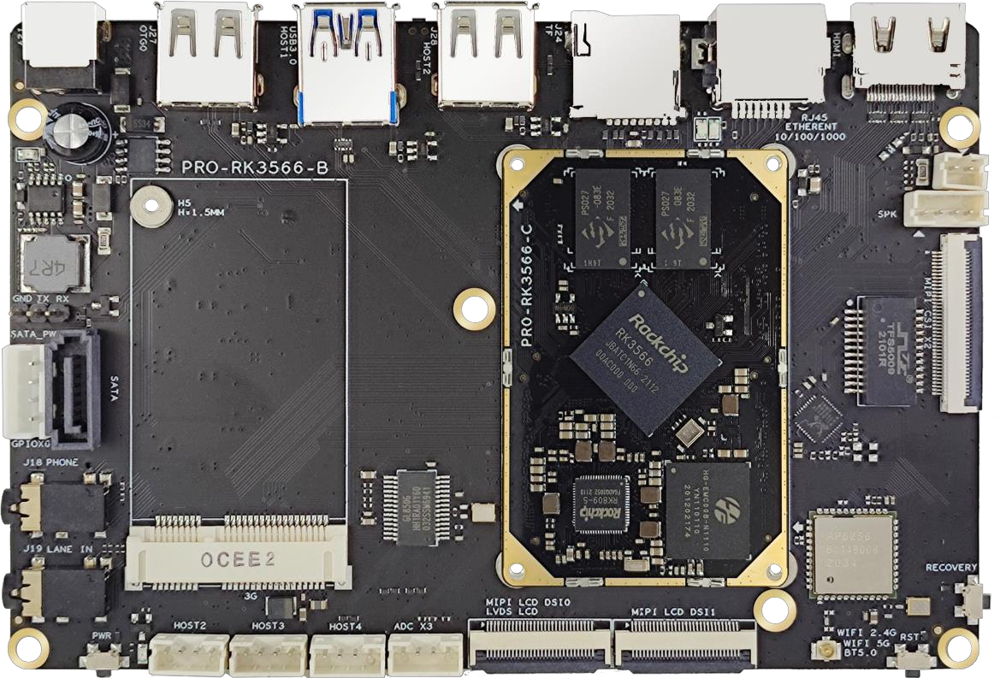
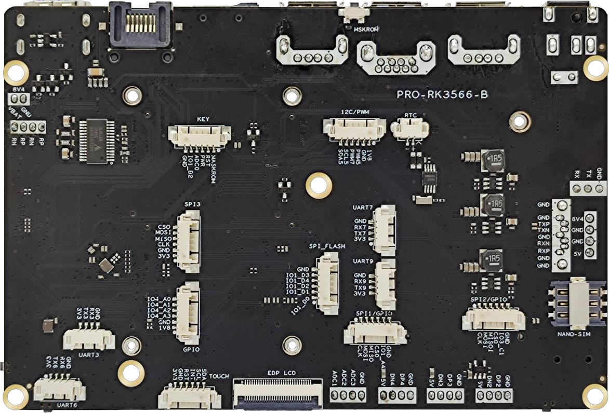
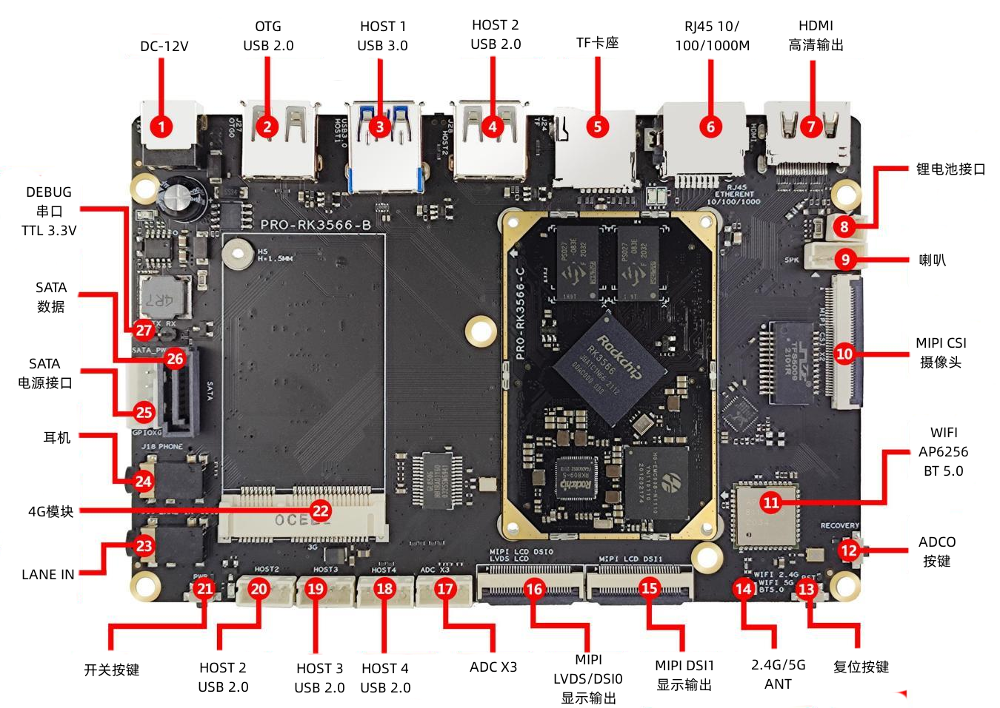
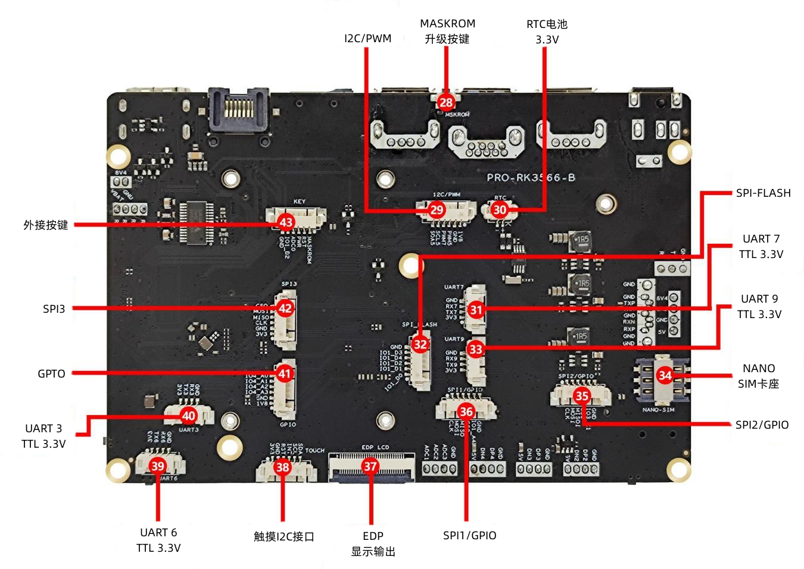
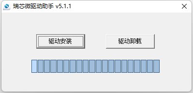
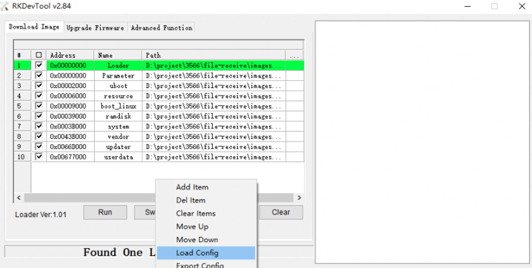
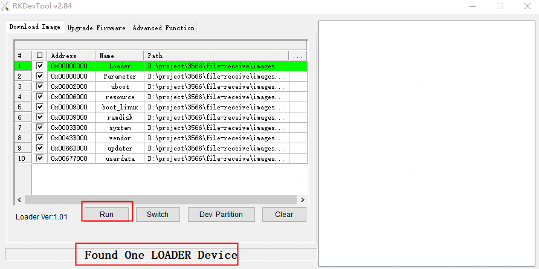
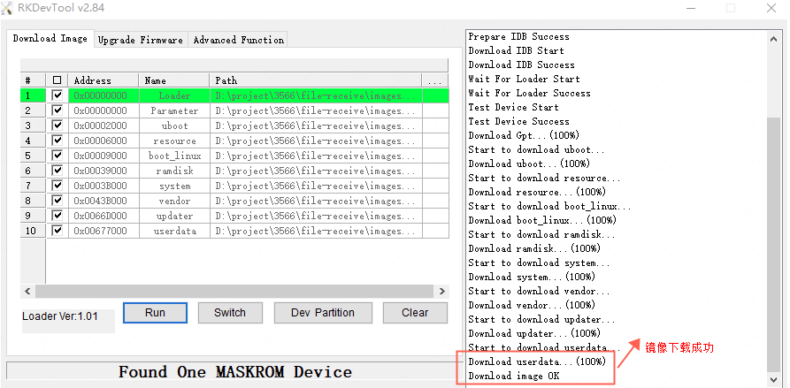

# khdvk_3566b开发套件

### **简介**

深开鸿khdvk_3566b采用ROCKCHIP RK3566 Cortex-A55四核处理器，支持应用场景深度定制的高性能开发平台，为技术设计到产品化过程提供快速高效的开发通道。提供多路通用显示屏接口，接口类型丰富，支持外设拓展，满足多种人机交互场景的需求，适用于平板电脑，学习机，人脸别相关，主要产品有匝机通道，刷脸支付，工业机器人，医疗检测设备，车牌识别，广告机、数字标牌、智能自助终端、智能零售终端等相关产品。

### 开发板详情

#### 1.基本功能列表

| 硬件指标 | 具体参数                                                                     |
| ---- |:------------------------------------------------------------------------ |
| 尺寸   | 135mm长*90mm宽*14mm高                                                       |
| 连接方式 | 板对板连接设计（核心板）                                                             |
| CPU  | ROCKCHIP RK3566四核A55                                                     |
| GPU  | ARM Mali-G52 2EE兼容OpenGL ES 1.1/2.0/3.2、OpenCL 2.0和Vulkan 1.1内嵌高性能2D加速硬件 |
| NPU  | 0.8TOPs，支持TensorFlow/Caffe等主流架构模型的转换                                     |
| 内存   | DDR4，标配4GB，选配2GB                                                         |
| 存储器  | EMMC 5.1，标配32GB，选配8GB/16GB/64GB                                          |
| 工作电压 | 12V 1.5A以上                                                               |
| 支持系统 | OpenHarmony                                                              |
| 工作温度 | -10℃～60℃                                                                 |
| 存储温度 | -30℃～70℃                                                                 |

| 主板常用接口      | 具体参数                        |
|:----------- |:--------------------------- |
| USB HOST2.0 | 5路USB，2路外接标准USB其中一路OTG，3路内接 |
| USB HOST3.0 | 1路外接标准USB 3.0接口             |
| 串口          | 5路TTL串口，其中一路为DEBUG          |
| HDMI显示      | 1路HDMI 2.0                  |
| EDP显示       | 支持EDP显示输出，最高1080P           |
| LVDS显示      | 支持单路LVDS显示输出，最高1280x800     |
| MIPI DSI显示  | 2路DSI显示输出，最高2K              |
| MIPI CSI输入  | 2路CSI MIPI摄像头接口             |
| 以太网         | 1路10/100/1000Mbps           |
| 语音输出        | 1路耳机左右声道输出，二路喇叭输出5W/8欧      |
| 语音输入        | 1路LANE IN输入                 |
| SATA        | SATA硬盘接口                    |
| TF卡         | TF卡接口最大128G                 |
| WIFI        | AP6256，2.4G/5G，双频WIFI       |
| 蓝牙          | AP6256，2.4G，蓝牙5.0           |
| SPI         | 3路SPI接口                     |
| I2C         | 2路I2C接口                     |
| PDM         | 4路PDM硅麦接口                   |
| GPIO        | 6路独立GPIO接口                  |
| GPS         | 外置GPS（可选）                   |
| ADC         | 3路ADC输入                     |
| 数据通信        | 4G功能，4G上网                   |
| RTC实时时钟     | HYM8563外置纽扣电池支持掉电时间保存       |

#### 2.主板展示图





#### 3.接口标识图





在组装使用过程中，请注意下面（且不限于）问题点：

➢ 裸板与外设短路问题。

➢ 在安装固定过程中，避免裸板因固定原因而造成变形问题。

➢ 安装MIPI/LVDS屏时，注意屏电压（3.3V、5V、12V）是否符合，注意屏座子第1脚方向问题。

➢ 安装双路LVDS屏时，注意屏背光电压（3.3V、5V、12V）是否符合。屏背光的功率在20W 以上的，建议使用其他电源板供电。

➢ 外设（USB，IO，UART）安装时，注意外设IO电平和电流输出问题。

➢ 串口安装时，注意不能直连RS232，RS485设备。TX，RX接法是否正确。

➢ 输入电源是否接入在电源输入接口上，根据总外设评估，输入电源电压，电流等是否满足要求。杜绝为了方便操作从背光插座进行接入供电输入电源。

### **搭建开发环境**

#### **1、安装依赖包**

安装命令如下：

```
sudo apt-get update && sudo apt-get install binutils git git-lfs gnupg flex bison gperf build-essential zip curl zlib1g-dev gcc-multilib g++-multilib libc6-dev-i386 lib32ncurses5-dev x11proto-core-dev libx11-dev lib32z1-dev ruby ccache libgl1-mesa-dev libxml2-utils xsltproc unzip m4 bc gnutls-bin python3-pip
```

```
sudo apt-get install device-tree-compiler
sudo apt-get install libssl-dev
sudo apt install libtinfo5
sudo apt install openjdk-11-jdk
sudo apt-get install liblz4-tool
pip3 install dataclasses
```

**说明：** 
以上安装命令适用于Ubuntu18.04，其他版本请根据安装包名称采用对应的安装命令。

#### **2、获取标准系统源码**

**前提条件**

1）注册码云gitee帐号。（https://gitee.com/signup）

2）注册码云SSH公钥，请参考[码云帮助中心](https://gitee.com/help/articles/4191)。

3）安装[git客户端](http://git-scm.com/book/zh/v2/%E8%B5%B7%E6%AD%A5-%E5%AE%89%E8%A3%85-Git)和[git-lfs](https://gitee.com/vcs-all-in-one/git-lfs?_from=gitee_search#downloading)并配置用户信息。

```
git config --global user.name "yourname"

git config --global user.email "your-email-address"

git config --global credential.helper store
```

4）安装码云repo工具，可以执行如下命令。

```
#如果没有权限，可下载至其他目录，并将其配置到环境变量中

curl -s https://gitee.com/oschina/repo/raw/fork_flow/repo-py3 > /usr/local/bin/repo 

chmod a+x /usr/local/bin/repo

pip3 install -i https://repo.huaweicloud.com/repository/pypi/simple requests
```

**获取源码**

1） 通过repo + ssh下载（需注册公钥，请参考[码云帮助中心](https://gitee.com/help/articles/4191)）。

```
repo init -u ssh://git@gitlab.kaihongdigi.com:3333/OpenHarmony_3566B/manifest.git -b master -m  khdvk_3566b-weekly0802.xml --no-repo-verify
```

2） 通过repo + https下载。

```
repo init -u http://gitlab.kaihongdigi.com:9010/OpenHarmony_3566B/manifest.git -b master -m  khdvk_3566b-weekly0802.xml --no-repo-verify
```

3）之后统一执行如下命令。

```
repo sync -c

repo forall -c 'git lfs pull'
```

**执行prebuilts**

在源码根目录下执行脚本，安装编译器及二进制工具。

```
bash build/prebuilts_download.sh
```

下载的prebuilts二进制默认存放在与OpenHarmony同目录下的OpenHarmony_canary_prebuilts下。

### **编译调试**

#### **1、编译**

在Linux环境进行如下操作:

1） 进入源码根目录，执行如下命令进行版本编译。

```
./build.sh --product-name khdvk_3566b
```

2） 检查编译结果，编译完成后，log中显示如下：

```
[OHOS INFO] khdvk_3566b build success
[OHOS INFO] cost time: 1:20:00
=====build  successful=====
2022-07-04 13:41:54
```

编译所生成的文件都归档在out/khdvk_3566b/目录下，结果镜像输出在
out/khdvk_3566b/packages/phone/images/ 目录下，需要烧录的文件有 MiniLoaderAll.bin，parameter.txt，boot.img，ramdisk.img，resource.img，system.img，updater.img，userdata.img，vendor.img。需要注意 uboot.img也是需要烧录的，获取地址为：http://ftpkaihongdigi.i234.me:5000/sharing/lKmniElWR 。

3） 编译源码完成，请进行镜像烧录。

#### **2、烧录**

烧写工具下载及使用。

rk的烧录之前需要安装对应的驱动和烧录工具，下载[DriverAssitant](common/tools/windows/DriverAssitant_v5.11.zip)和[RKDevTool_Release](common/tools/windows/RKDevTool_Release_v2.91.zip)

安装驱动



烧录

建议将images拷贝到Windows目录下，然后用RKDevTool进行烧录

进入load模式:

接上电源，同时按住reset和recovery，然后松开reset，大约两秒钟后，软件提示发现一个loader设备松开recovery按键即可。

多个镜像烧录或者单独烧录某个镜像，在下载镜像界面点击鼠标右键，选择导入配置，导入后选择对应的Parameter.txt进行加载，加载完成后选择对应镜像的路径即可，一般来说对应的名字和img名是一一对应的。

插入设备，将设备进入到loader模式或者maskrom模式进行烧录，当软件提示发现一个loader设备或者maskrom设备的时候，点击执行即可进行烧录。右边显示Download image ok表明镜像下载成功，系统重启进入桌面表示烧录成功。






