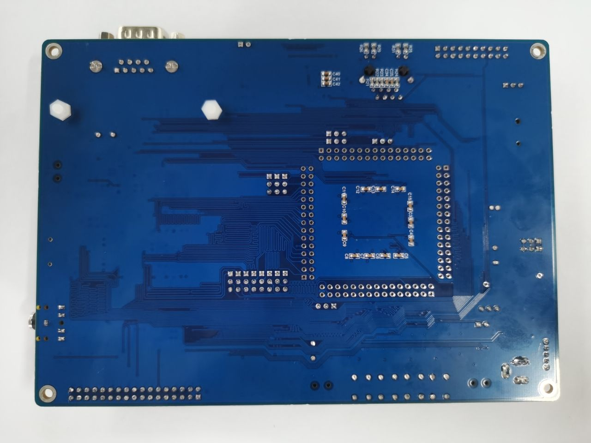

# KHDVK-450A开发板

## 介绍

KHDVK-450A开发板使用GD32F450ZKT6作为主控制器，使用Mini USB接口或者DC-005连接器提供5V电源，提供包括扩展引脚在内的SWD、Reset、Boot、User button key、LED、CAN、I2C、I2S、USART、RTC、LCD、SPI、ADC、DAC、EXMC、CTC、SDIO、ENET、USBFS、USBHS等外设资源。

开发板支持OpenHarmony 轻量系统，并支持display、以太网通讯等能力，可广泛应用于人工智能、工业控制、电机变频、图形显示、传感器网络、无人机、机器人、物联网等创新领域。

**图1** KHDVK-450A开发板正面外观图

**图2** KHDVK-450A开发板背面外观图

## 规格

KHDVK-450A开发板MCU处理器规格及通用规格清单如表1所示：

**表1** KHDVK-450A开发板MCU处理器规格及通用规格清单

<table>
   <tr>
        <td rowspan="1">芯片</td> 
        <td>兆易创新GD32F450ZKT6芯片</td> 
   </tr>
   <tr>
        <td>架构</td> 
        <td>ARM</td> 
   </tr>
    <tr>
        <td>主频</td> 
        <td>200 MHz</td> 
   </tr>
    <tr>
        <td>工作电压</td> 
        <td>5V</td> 
   </tr>
    <tr>
        <td>内存&存储</td> 
        <td>内置512 KB至3072 KB闪存；内置256KB至512KB SRAM；EXMC接口支持外部SDRAM与SRAM；</td> 
   </tr>
   <tr>
        <td rowspan="5">通用规格</td>  
        <td >支持OpenHarmony轻量系统</td>  
    </tr>
    <tr>
        <td >支持SDIO、以太网MAC</td>  
    </tr>
    <tr>
        <td >8个UART(9Mbit/s)；6个SPI (30Mbit/s)； 3个I2C (400Kbit/s)；</td>  
    </tr>
    <tr>
        <td >高达3个12位，2.6M SPS ADC（高达24通道）</td>  
    </tr>
    <tr>
        <td >丰富的扩展接口，支持多种视频输入输出接口（详见底板规格说明）</td>  
    </tr>
</table>

KHDVK-450A开发板底板规格说明如表2所示：

**表2** KHDVK-450A开发板底板规格说明

| 接口名称              | 接口说明               |
| --------------------- | ---------------------- |
| 显示接口              | LCD (320*480)          |
| 以太网                | 1个10/100M以太网控制器 |
| LED                   | 3个                    |
| WDG                   | 1路                    |
| USART+UART            | 4+4路                  |
| I2C                   | 3路                    |
| SPI                   | 6路                    |
| CAN 2.0B              | 2路                    |
| USB 2.0               | FS_OTG+HS_OTG          |
| I2S                   | 2路                    |
| SDIO                  | 1路                    |
| EXMC/SDRAM            | 1/1路                  |
| 12bit ADC Units (CHs) | 3(24)路                |
| 12bit DAC Units       | 2路                    |

## 关键特性

KHDVK-450A开发板支持OpenHarmony 轻量系统，并支持display、以太网通讯等能力，可广泛应用于人工智能、工业控制、电机变频、图形显示、传感器网络、无人机、机器人、物联网等创新领域。

## 固件烧录

KHDVK-450A固件烧录实践请参考[KHDVK-450A固件烧录实践](https://gitee.com/openharmony-sig/vendor_kaihong/blob/master/khdvk_450a/README_zh.md)
